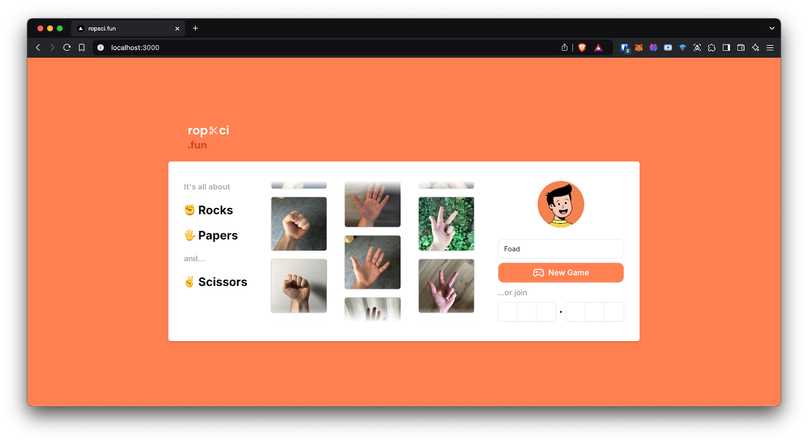
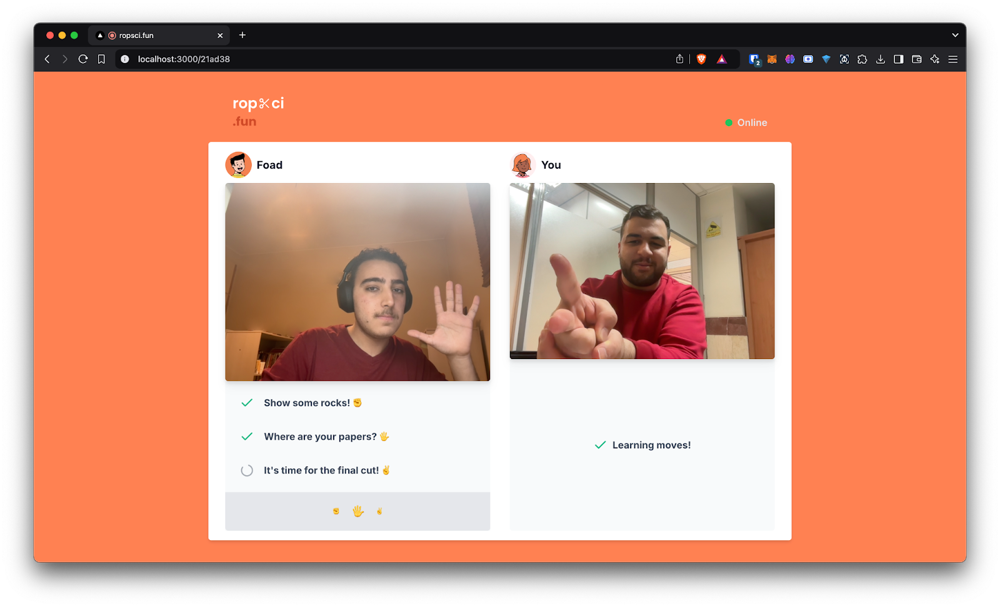

# ROPSCI, Rock Paper Scissors 🪨📄✂️

This repository contains an interactive **Rock Paper Scissors** game implemented using **computer vision** techniques. The project leverages **deep learning** to recognize hand gestures in real-time, providing an engaging and interactive experience. This is the final project of the **Computer Vision** course.

## 📁 Project Structure
The project is organized as follows:

```plaintext
├── backend/             # Backend of the project written with Django
├── frontend/            # Frontend of the project written with Nextjs
├── images/              # Readme images
├── README.md            # Main README file
└── LICENSE              # License
```
## 🎯 Project Overview



The goal of this project is to implement an **interactive Rock-Paper-Scissors game** using **computer vision**. The system detects hand gestures via a **deep learning model (YOLOv11)** and displays the game results in real time.

### Key Features:
- 🎥 Real-time hand gesture recognition
- 🎮 Intuitive user interface
- 🚫 Anti-cheating mechanisms
- 👥 Multiplayer mode with WebSockets
- ⚡ Optimized performance for smooth gameplay

## 🛠️ Tech Stack

### **Frontend (User Interface)**
- **Next.js** and **React** for a dynamic and responsive UI
- **WebSocket** integration for real-time multiplayer communication

### **Backend (Game Logic & API)**
- **Django & Django Channels** for managing game logic
- **WebSocket support** for real-time communication
- **YOLOv11** for hand gesture recognition
- **Redis** for message brokering and fast state management

### **Machine Learning Model**
- **YOLOv11** trained on a dataset of hand gestures (rock, paper, scissors)
- **Data augmentation** for improved accuracy
- **Real-time inference** for smooth gameplay

## 🚀 Installation & Setup
First, copy one of your desired models from the `models` folder to the `backend` folder and rename it to `model.pt`. Then, execute these commands.

```sh
git clone https://github.com/mfrashidi/ropsci.git
cd ropsci
cd backend
python -m venv venv
source venv/bin/activate   # On Windows, use `venv\Scripts\activate`
pip install -r requirements.txt
python manage.py makemigrations
python manage.py migrate
daphne ropsci.asgi:application -b localhost -p 8000 # Websocket
daphne ropsci.asgi:application -b localhost -p 8001 # API
cd ../frontend
npm i
npm run dev
```
Now you can play the game from http://localhost:3000

---

## 🧪 Dataset & Model Training

### **Dataset Collection**
- Over **1000 images** were collected for each hand gesture (**rock, paper, scissors**) from different angles and lighting conditions.
- **Data augmentation** techniques (rotation, brightness adjustment) were applied to enhance model performance.

### **Model Training**
- Used **YOLOv11** for real-time object detection.
- **Roboflow** was used to preprocess and annotate the dataset.
- The model was trained with **150 epochs**, achieving high accuracy.
- **Small and nano versions** of YOLO were tested for performance vs accuracy.

## 🎮 Game Features



### Multiplayer Support
- Players can **create a room** and invite friends using a unique game code.
- The game is synchronized in real-time via **WebSockets**.

### Anti-Cheat System
- The game **detects fake movements** and **prevents last-second changes**.
- A **red mask** is applied to cheaters to indicate a rule violation.

### Winner Announcement
- The **final winner** is announced at the end of the rounds.
- A **golden crown** is displayed on the winner's avatar.

## 3D Models (Crown & Mask)
- **Three.js** and **Mediapipe** were used to overlay **3D objects** (a crown for winners and a mask for cheaters).
- Lightweight **OBJ models** were loaded dynamically for optimized rendering.

---

This project was developed by **@mfrashidi** and **@Bahram03** and **@Arshiapdr**. We hope you enjoy playing Rock-Paper-Scissors with our interactive computer vision game! 🎉


